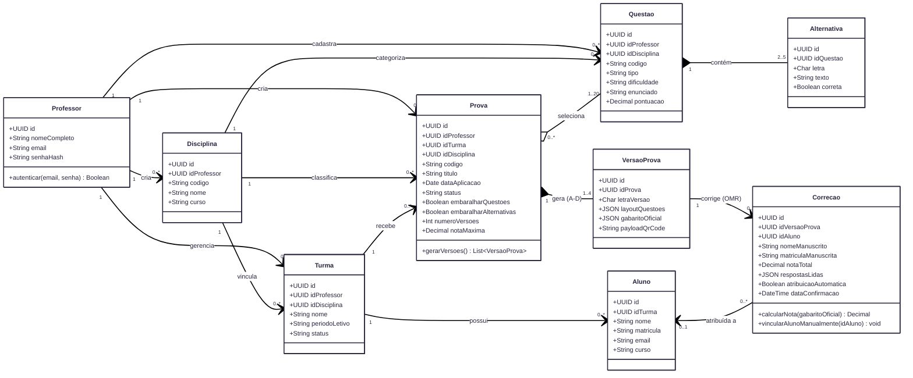

# 📐 Diagrama de Classes — SGP / Correge

```mermaid
---
config:
  theme: redux
  class:
    nodeSpacing: 25
    rankSpacing: 35
---
classDiagram
      direction LR

      class Professor {
          +UUID id
          +String nomeCompleto
          +String email
          +String senhaHash
          +autenticar(email, senha) Boolean
      }
      class Disciplina {
          +UUID id
          +UUID idProfessor
          +String codigo
          +String nome
          +String curso
      }
      class Turma {
          +UUID id
          +UUID idProfessor
          +UUID idDisciplina
          +String nome
          +String periodoLetivo
          +String status
      }
      class Prova {
          +UUID id
          +UUID idProfessor
          +UUID idTurma
          +UUID idDisciplina
          +String codigo
          +String titulo
          +Date dataAplicacao
          +String status
          +Boolean embaralharQuestoes
          +Boolean embaralharAlternativas
          +Int numeroVersoes
          +Decimal notaMaxima
          +gerarVersoes() List~VersaoProva~
      }
      class Questao {
          +UUID id
          +UUID idProfessor
          +UUID idDisciplina
          +String codigo
          +String tipo
          +String dificuldade
          +String enunciado
          +Decimal pontuacao
      }
      class Aluno {
          +UUID id
          +UUID idTurma
          +String nome
          +String matricula
          +String email
          +String curso
      }
      class VersaoProva {
          +UUID id
          +UUID idProva
          +Char letraVersao
          +JSON layoutQuestoes
          +JSON gabaritoOficial
          +String payloadQrCode
      }
      class Alternativa {
          +UUID id
          +UUID idQuestao
          +Char letra
          +String texto
          +Boolean correta
      }
      class Correcao {
          +UUID id
          +UUID idVersaoProva
          +UUID idAluno
          +String nomeManuscrito
          +String matriculaManuscrita
          +Decimal notaTotal
          +JSON respostasLidas
          +Boolean atribuicaoAutomatica
          +DateTime dataConfirmacao
          +calcularNota(gabaritoOficial) Decimal
          +vincularAlunoManualmente(idAluno) void
      }

      %% Professor -> Entidades Principais
      Professor "1" --> "0..*" Disciplina : cria
      Professor "1" --> "0..*" Turma : gerencia
      Professor "1" --> "0..*" Prova : cria
      Professor "1" --> "0..*" Questao : cadastra

      %% Disciplina -> Turma, Prova, Questao
      Disciplina "1" --> "0..*" Turma : vincula
      Disciplina "1" --> "0..*" Prova : classifica
      Disciplina "1" --> "0..*" Questao : categoriza

      %% Ligações verticais na Coluna 2
      Turma "1" --> "0..*" Prova : recebe
      Prova "0..*" o-- "1..20" Questao : seleciona

      %% Coluna 2 -> Coluna 3
      Turma "1" --> "0..*" Aluno : possui
      Prova "1" *-- "1..4" VersaoProva : gera (A-D)
      Questao "1" *-- "2..5" Alternativa : contém

      %% Coluna 3 -> Coluna 4
      VersaoProva "1" --> "0..*" Correcao : corrige (OMR)
      Aluno "0..1" <-- "0..*" Correcao : atribuída a
```
