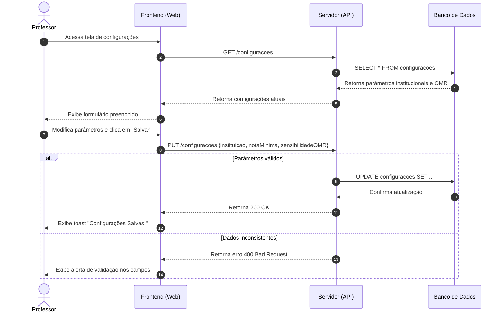

# ⚙️ Diagrama de Sequência — Tela de Configurações

🔎 Passo 4C — Como Analisar e Ler o Diagrama
Regra de ouro: leia sempre de cima para baixo, como se fosse o feed de um celular.

Cenário analisado: Consulta e Atualização das Configurações do Sistema.

Atores e objetos (o elenco): no topo, os participantes na horizontal (Professor, Frontend, Servidor, BancoDeDados).
Linhas de vida (o tempo passando): as linhas tracejadas verticais que descem de cada objeto representam o tempo correndo — quanto mais abaixo, mais tarde o evento acontece.
Mensagens (os diálogos): setas horizontais mostram o pedido/ação de um objeto para o outro. Setas contínuas = envio de requisição; setas tracejadas = retorno da resposta.
Bloco alt (alternativas/decisões): representa desvios condicionais (o famoso SE/SENÃO) — a validação dos parâmetros informados (nota de corte e sensibilidade OMR), salvando no banco ou retornando erro de campos inválidos.

